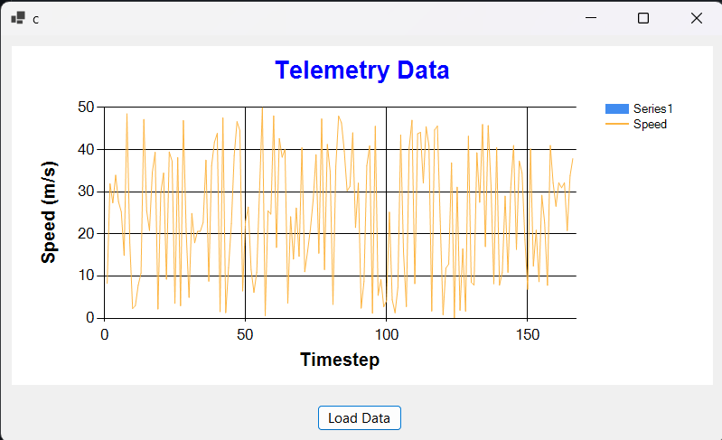
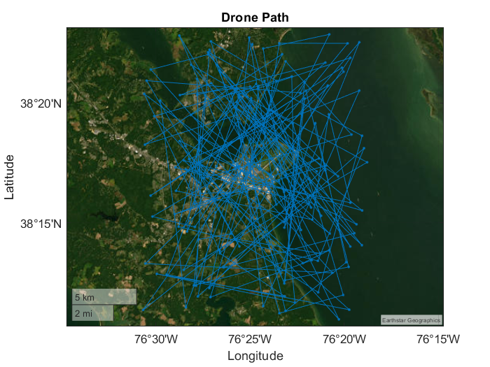

# Telemetry Data Processor
This project involves the generation, storage, and visualization of telemetry data using Python, C#, and MATLAB. The telemetry data is stored in an SQLite database, and the project includes tools to visualize this data in a Windows Forms application and MATLAB.






## Project Structure

### Python Scripts

#### `generate_telemetry_data.py`
This script generates telemetry data and stores it in an SQLite database. The script uses the `sqlite3` and `random` modules to interact with the database and generate random telemetry data.


### C# Windows Forms Application

#### `TelemetryDataProcessor`
This Windows Forms application visualizes telemetry data stored in an SQLite database. The application uses the `System.Data.SQLite` library to interact with the database and retrieve telemetry data.

### MATLAB Scripts

#### `visualize_telemetry_with_matlab.m`
This script visualizes telemetry data stored in an SQLite database using MATLAB. The script uses the `sqlite` library to interact with the database and retrieve telemetry data.

## Running the Project

1. Run the `generate_telemetry_data.py` script to generate telemetry data and store it in the SQLite database.
1. Run the `TelemetryDataProcessor` Windows Forms application to visualize the telemetry data.
1. Run the `visualize_telemetry_with_matlab.m` script in MATLAB to visualize the telemetry data.

## Requirements

### Python
Ensure you have Python installed. Required libraries include `sqlalchemy` and `numpy`.

### C#
Visual Studio 2022 with .NET 6.0 SDK.

### MATLAB
MATLAB R2024a or later.

## Setting Up
1. Close the repository.

```bash
git clone https://github.com/ronen-g-aniti/drone-algorithms/
```

2. Set Up Python Environment

```bash
pip install sqlalchemy numpy
```

3. Generate Telemetry Data

```bash
python generate_telemetry_data.py
```

4. Open and Run the C# Windows Forms Application
Open the `TelemetryDataProcessor` solution in Visual Studio and run the application.

5. Open and Run the MATLAB Script

```bash
visualize_telemetry_with_matlab
```